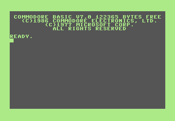

## Hi there 👋

Here you'll find set of useful KickAssembler libraries for native Commodore 128-development as well as a few supporting tools.

This work is strongly inspired by the [c64lib](https://github.com/c64lib) project (created by [Maciej Małecki](https://github.com/maciejmalecki)), extending it where necessary to support the functionality of the C128.

I'm also building a memory map reference available [here](https://c128lib.github.io/Reference).

Thank you for been here, if you want to contribute (to the project and/or the reference guide) you're welcome, skills required are:
* 6502/8502 assembly and architecture
* KickAssembler
* (obviusly) Git commit/pull/push/pull request and integration with GitHub

In this case, send me an email (raffaele.intorcia at gmail.com) with your GitHub account name.

If you are already a developer team member you can start with [team discussion page](https://github.com/orgs/c128lib/teams) or [project page](https://github.com/orgs/c128lib/projects/1)
